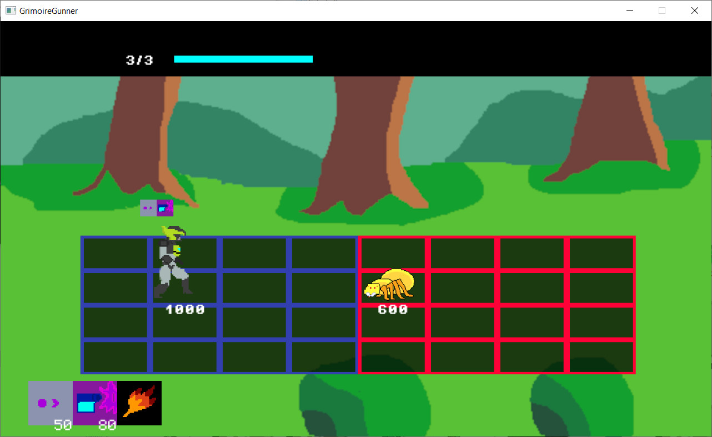
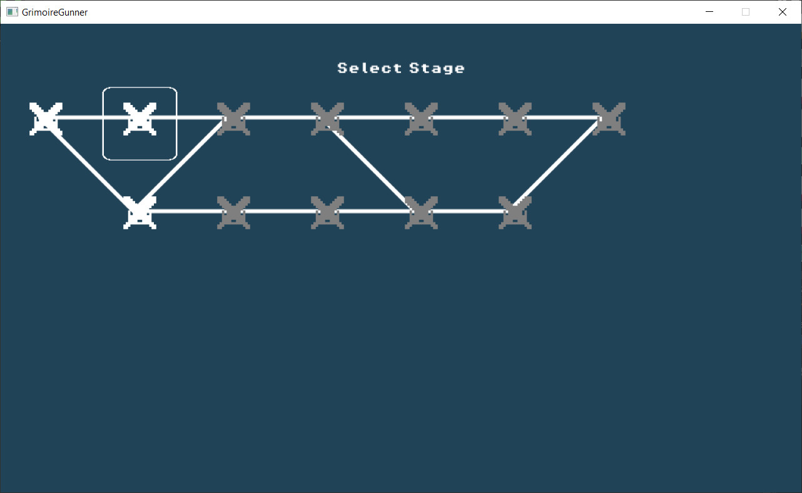

# GrimoireGunner

A simple grid based combat like "one step from eden" and megaman battle network. I implement a different approach in combat where the player will have some loadout mechanic so rng should be less of an issue and the player can approach the combat more strategically.

## Control

arrow keys : move character

"q" : use weapon on slot1 of current loadout

"w" : use weapon on slot2 of current loadout

"e" : use default weapon, currently it is just simple bullet

"space" : cycle loadout

## Screenshoot

